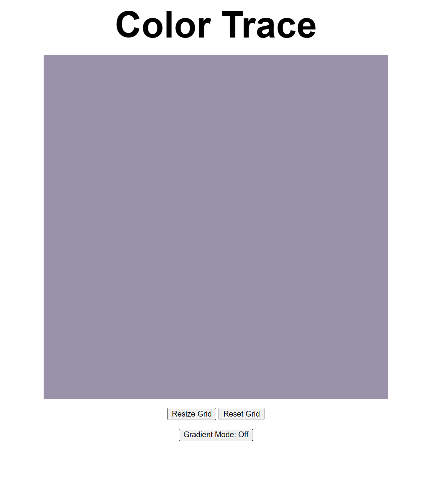
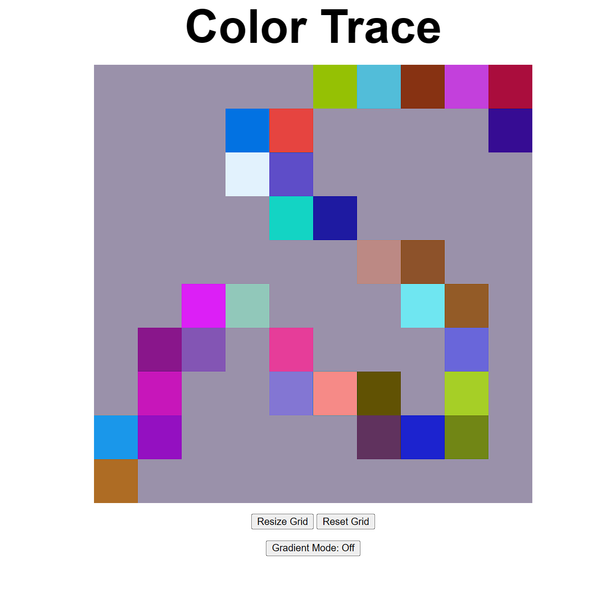
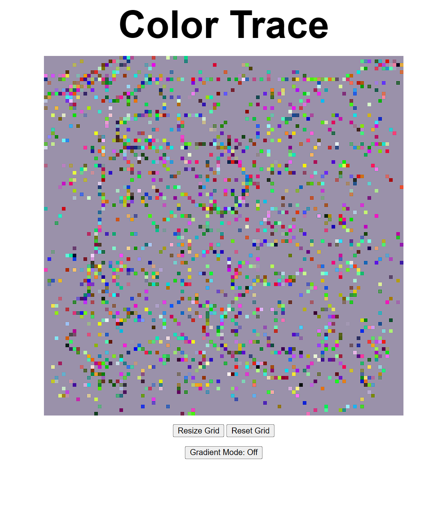
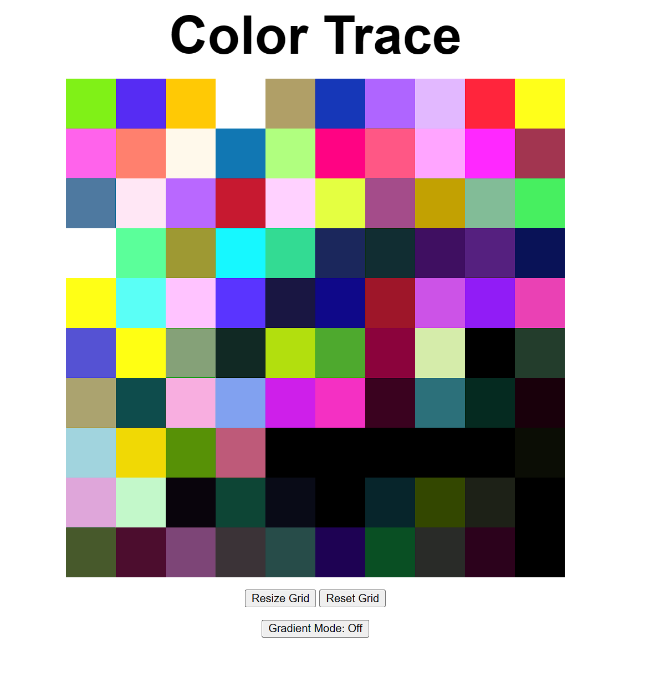

# ColorTrace

Implementation of the Etch-a-Sketch project in The Odin Project Foundations Course.

The sketch pad is made up of grid squares that change to a randomly genereated color on hover. The user can change the resolution of the grid squares between 1 large square and a 100x100 grid. The default size is 10x10.

Turning on gradient mode applies a brightness filter to the grid squares on hover. The squares will become 10% darker or lighter based on whether Dark Mode or Light Mode is toggled.

Reset Grid will restore all grids to the default color and resize to 10x10.

## Initial View

## Example Trace (Default Size, Gradient Mode Off)

## Example Trace (100x100, Gradient Mode Off)

## Example Trace (10x10, Gradient Mode On)

Squares in the bottom right have the dark gradient applied, squares in the top left have the light gradient applied, and squares in the middle have the normal brightness applied.

Add extra branch to mess with GitHub API calls
